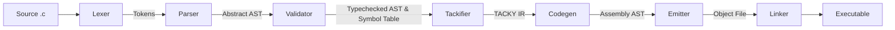

# NCC - Not Completely C

[](https://github.com/johnhringiv/NCC-Rust/actions/workflows/lint.yml)
[](https://codecov.io/gh/johnhringiv/NCC-Rust)

A (**N**ot **C**ompletely) **C** compiler written in Rust, inspired by Sandler's "Writing a C Compiler".

NCC is a full pipeline compiler, going from lexing all the way down to x86-64 machine code emission and linking.
Machine code is encoded directly using [iced-x86](https://github.com/icedland/iced) and emitted to ELF/Mach-O
object files via the [object](https://github.com/gimli-rs/object) crate—no external assembler required.
A substantial subset of C is supported, including functions, static variables, all control flow statements, and
bitwise operations. Additionally, NCC supports developer-friendly warnings and pretty-printing of each compiler pass.
Runs on Linux and macOS (Intel).

## Example

This [Collatz Conjecture](https://en.wikipedia.org/wiki/Collatz_conjecture) program compiles and runs with NCC,
demonstrating static variables, functions, loops, bitwise operations, and conditionals:

```c
// Collatz Conjecture Explorer
//
// For any positive integer n:
//   - If n is even: n = n / 2
//   - If n is odd:  n = 3n + 1
// The conjecture states this always reaches 1.
//
// Which number under 100 takes the most steps?

static int total_steps = 0;

int collatz(int n) {
    int steps = 0;
    while (n != 1) {
        if (n & 1) {
            n = 3 * n + 1;    // odd
        } else {
            n = n >> 1;       // even: divide by 2
        }
        steps++;
    }
    total_steps += steps;
    return steps;
}

int main(void) {
    int champion = 1;
    int max_steps = 0;

    for (int i = 1; i < 100; i++) {
        int steps = collatz(i);
        if (steps > max_steps) {
            max_steps = steps;
            champion = i;
        }
    }

    // Returns 97: takes 118 steps to reach 1!
    // 97 -> 292 -> 146 -> 73 -> 220 -> 110 -> 55 -> ... -> 1
    return champion;
}
```

### Generated Assembly

C code alongside the x86-64 assembly NCC generates (`ncc -S`). Labels are pretty-printed using
the original function and variable names from the source. Redundant moves will be eliminated
once copy propagation is implemented:

<table>
<tr>
<th>C Code</th>
<th>Generated Assembly</th>
</tr>
<tr>
<td>

```c
static int counter = 0;

int next(void) {
    counter++;
    return counter;
}

int main(void) {
    return next() + next();
}
```

</td>
<td>

```asm
next:
  push %rbp
  mov %rsp,%rbp
  sub $16,%rsp
  mov counter(%rip),%r10d
  mov %r10d,-4(%rbp)
  mov counter(%rip),%r10d
  mov %r10d,-8(%rbp)
  addl $1,-8(%rbp)
  mov -8(%rbp),%r10d
  mov %r10d,counter(%rip)
  mov counter(%rip),%eax
  mov %rbp,%rsp
  pop %rbp
  ret

main:
  push %rbp
  mov %rsp,%rbp
  sub $16,%rsp
  call next
  mov %eax,-4(%rbp)
  mov -4(%rbp),%r10d
  mov %r10d,-8(%rbp)
  call next
  mov %eax,-12(%rbp)
  mov -8(%rbp),%r10d
  mov %r10d,-16(%rbp)
  mov -12(%rbp),%r10d
  add %r10d,-16(%rbp)
  mov -16(%rbp),%eax
  mov %rbp,%rsp
  pop %rbp
  ret

.bss
counter:
  .zero 4
```

</td>
</tr>
</table>

## Usage

```
ncc [OPTIONS] <FILENAMES>...
```

### Arguments

`<FILENAMES>...` Input files (required). Supports multiple C and assembly files.

### Options

| Option                    | Description                                              |
|---------------------------|----------------------------------------------------------|
| `--lex`                   | Run lexer                                                |
| `--parse`                 | Run lexer and parser                                     |
| `--validate`              | Run lexer, parser, and validator                         |
| `--codegen`               | Run lexer, parser, and code generator                    |
| `--tacky`                 | Emit TACKY IR                                            |
| `-S`                      | Emit assembly                                            |
| `--run`                   | Run compiled program and print result                    |
| `-c`                      | Emit object file only (no linking)                       |
| `--external-linker`       | Use system linker (`ld`) instead of built-in libwild     |
| `--static`                | Link statically (no runtime dependencies) - Linux only   |
| `--no-iced`               | Use text-based asm building instead of iced (deprecated) |
| `-o`, `--output <OUTPUT>` | Override output file location                            |
| `-h`, `--help`            | Print help                                               |

Note: `--lex`, `--parse`, `--validate`, `--codegen`, `--tacky`, `-S`, `--run`, `-c` are mutually exclusive options.

### Exit Codes

| Exit Code | Description                                   |
|-----------|-----------------------------------------------|
| 0         | Success                                       |
| 1         | General error (file I/O, compilation failure) |
| 10        | Lexer error (tokenization failed)             |
| 20        | Parser error (syntax error)                   |
| 30        | Validation error (semantic error)             |

## Architecture

NCC follows a classic multi-pass compiler pipeline:



| Pass | Description |
|------|-------------|
| **Lexer** | Converts source text into tokens using regex patterns with maximal munch. Each token carries a span (file, line, column) for error reporting. |
| **Parser** | Recursive descent with precedence climbing. Builds an abstract syntax tree while handling operator precedence and associativity. |
| **Validator** | Two-pass semantic analysis: (1) resolves variables to unique names, labels loops/switches, validates gotos; (2) type checks, builds symbol table, evaluates constant expressions. |
| **Tackifier** | Lowers the AST to TACKY, a three-address code IR. Flattens nested expressions into sequences of simple operations and makes control flow explicit with jumps and labels. |
| **Codegen** | Converts TACKY to an x86-64 assembly AST. Assigns pseudo-registers to stack slots, fixes invalid instructions, and implements the System V AMD64 calling convention. |
| **Emitter** | Encodes instructions to machine code using [iced-x86](https://github.com/icedland/iced) and writes ELF/Mach-O object files via the [object](https://github.com/gimli-rs/object) crate. |
| **Linker** | Resolves external symbols and produces the final executable. Uses [wild](https://github.com/nicholasbishop/wild) on Linux; shells out to `ld` on macOS. |

## Language Grammar

The compiler currently implements a subset of C with the following grammar:

```ebnf
<program> ::= { <declaration> }
<declaration> ::= <variable-declaration> | <function-declaration>
<variable-declaration> ::= { <specifier> }+ <identifier> [ "=" <exp> ] ";"
<function-declaration> ::= { <specifier> }+ <identifier> "(" <param-list> ")" ( <block> | ";" )
<param-list> ::= "void" | "int" <identifier> { "," "int" <identifier> }
<specifier> ::= "int" | "static" | "extern"
<block> ::= "{" { <block-item> } "}"
<block-item> ::= <statement> | <declaration>
<for-init> ::= <variable-declaration> | [ <exp> ] ";"
<statement> ::= "return" <exp> ";"
            | <exp> ";"
            | "if" "(" <exp> ")" <statement> [ "else" <statement> ]
            | "goto" <identifier> ";"
            | <identifier> ":" <statement>
            | <block>
            | "break" ";"
            | "continue" ";"
            | "while" "(" <exp> ")" <statement>
            | "do" <statement> "while" "(" <exp> ")" ";"
            | "for" "(" <for-init> [ <exp> ] ";" [ <exp> ] ")" <statement>
            | "switch" "(" <exp> ")" <statement>
            | "case" <exp> ":" <statement>
            | "default" ":" <statement>
            | ";"
<exp> ::= <factor> | <exp> <binop> <exp> | <exp> <assign-op> <exp>
       | <exp> "?" <exp> ":" <exp> | <exp> "++" | <exp> "--"
<factor> ::= <int> | <identifier> | <unop> <factor> | "++" <factor> | "--" <factor> | "(" <exp> ")"
          | <identifier> "(" [ <argument-list> ] ")"
<argument-list> ::= <exp> { "," <exp> }
<unop> ::= "-" | "~" | "!"
<binop> ::= "-" | "+" | "*" | "/" | "%" | "&" | "|" | "^" | "<<" | ">>" | "&&" | "||"
         | "==" | "!=" | "<" | "<=" | ">" | ">="
<assign-op> ::= "=" | "+=" | "-=" | "*=" | "/=" | "%=" | "&=" | "|=" | "^=" | "<<=" | ">>="
<identifier> ::= ? An identifier token ?
<int> ::= ? A constant token ?
```

### Supported Features

The compiler supports:

- **Multiple functions**: Function definitions and forward declarations
- **Function calls**: Call functions with arguments using the x86-64 System V ABI (first 6 integer arguments in
  registers RDI, RSI, RDX, RCX, R8, R9; additional arguments on the stack)
- **Local variable declarations** with optional initialization
- **File-scope (global) variables**: Defined at file scope with optional initializers (must be constant expressions)
- **Storage-class specifiers**: `static` (internal linkage) and `extern` (external linkage) for both variables and
  functions
- **Compound statements (blocks)**: `{ ... }` with proper scoping
- **Variable scoping**: Block-local variables with shadowing support
- **Integer arithmetic**: addition, subtraction, multiplication, division, modulo
- **Bitwise operations**: AND (`&`), OR (`|`), XOR (`^`), complement (`~`), left/right shift (`<<`, `>>`)
- **Logical operations**: AND (`&&`), OR (`||`), NOT (`!`) with short-circuit evaluation
- **Comparison operators**: `==`, `!=`, `<`, `>`, `<=`, `>=`
- **Assignment operators**: simple (`=`) and compound (`+=`, `-=`, `*=`, `/=`, `%=`, `&=`, `|=`, `^=`, `<<=`, `>>=`)
- **Increment/decrement**: prefix (`++x`, `--x`) and postfix (`x++`, `x--`)
- **Conditional (ternary) operator**: `condition ? true_expr : false_expr`
- **Control flow**:
    - `if`/`else` statements
    - `switch` statements with `case` and `default` labels
    - `while` loops
    - `do-while` loops
    - `for` loops with all three components (init, condition, update)
    - `break` and `continue` statements
    - Compound statements/blocks
    - `goto` and labeled statements
    - `return` statements
- **Expression statements** and **null statements**

### Safer C

NCC provides several safety features and guarantees to help developers write more reliable code:

#### Guaranteed Behaviors

- **Deterministic integer overflow**: Integer arithmetic uses two's complement wrapping (32-bit). For example,
  `INT_MAX + 1` reliably wraps to `INT_MIN`.
- **Left-to-right evaluation**: Binary operations are evaluated left to right, eliminating undefined behavior from
  evaluation order.

#### Compile-Time Warnings

- **Variable shadowing** (`-Wshadow`): Warns when a variable declaration shadows a previous declaration in an outer
  scope
- **Duplicate switch cases** (`-Wswitch-unreachable`): Detects and reports duplicate case values in switch statements,
  including those from constant expressions
- **Unused parameters** (`-Wunused-parameter`): Warns when a function parameter is declared but never used in the
  function body

#### Developer Experience

- **Precise error locations**: All errors and warnings include exact line and column numbers with file:line:column
  format, making it easy to locate problematic code
- **Contextual error messages**: Semantic errors reference related code locations (e.g., showing both the shadowing
  variable and the original declaration)
- **Pretty-printed ASTs**: Visual tree representations of parsed code (`--parse`), intermediate representations (
  `--tacky`), and generated code (`--codegen`) for debugging and understanding compilation stages

These features help catch common bugs at compile time while providing predictable runtime behavior.

## Requirements

- Rust (latest stable)
- A C toolchain to provide and locate system libraries (CRT & libc) - `cc` is not used for compilation

### Linux

```bash
sudo apt install build-essential

# For Makefile (optional - linting/formatting)
sudo apt install pkg-config libssl-dev make
```

### macOS

```bash
xcode-select --install
```

## Setup

```bash
# Clone the repository
gh repo clone johnhringiv/NCC-Rust

# Install Rust
curl --proto '=https' --tlsv1.2 -sSf https://sh.rustup.rs | sh

# Initialize submodules
git submodule update --init
```

## Building

```sh
cargo build --release
```

### Running Tests

```sh
cargo test
```

## Contributing

Use the Makefile to check code quality (`make quality`) and fix formatting (`make fix`).
